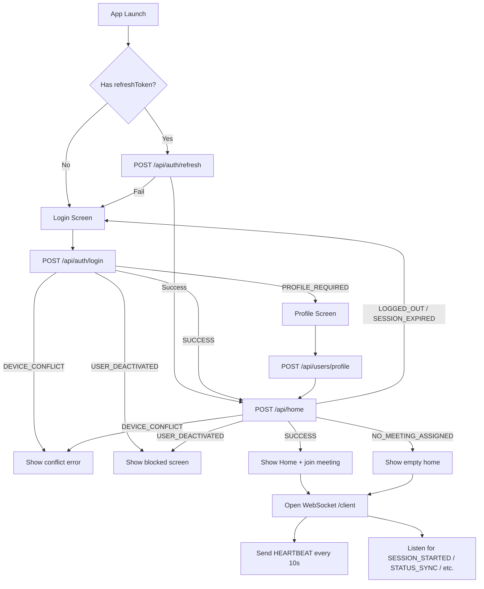

# Android APK — Complete API & WebSocket Guide

**Version:** 1.0 (matches current backend implementation)  
**Production base URL:** `https://zoomcontrol.onrender.com`  
**API prefix:** `https://zoomcontrol.onrender.com/api`  
**WebSocket namespace:** `wss://zoomcontrol.onrender.com/client`

This document is the single reference for Android developers integrating with the ZoomControl backend. It covers every REST endpoint the APK uses, the full WebSocket protocol, authentication, error handling, and recommended app flows.

---

## Table of contents

1. [Architecture overview](#1-architecture-overview)
2. [Authentication model](#2-authentication-model)
3. [Recommended app flow](#3-recommended-app-flow)
4. [REST API reference](#4-rest-api-reference)
   - [POST /api/auth/login](#post-apiauthlogin)
   - [POST /api/auth/refresh](#post-apiauthrefresh)
   - [POST /api/auth/logout](#post-apiauthlogout)
   - [POST /api/users/profile](#post-apiusersprofile)
   - [POST /api/home](#post-apihome)
   - [POST /api/token/zoom](#post-apitokenzoom)
   - [POST /api/user-voice-recordings](#post-apiuser-voice-recordings)
5. [WebSocket — `/client` namespace](#5-websocket--client-namespace)
6. [Zoom meeting join flow](#6-zoom-meeting-join-flow)
7. [Error handling guide](#7-error-handling-guide)
8. [Android implementation checklist](#8-android-implementation-checklist)
9. [Retrofit interface examples](#9-retrofit-interface-examples)
10. [Quick reference tables](#10-quick-reference-tables)

---

## 1. Architecture overview

```
┌─────────────────┐         REST (Retrofit)          ┌──────────────────────────┐
│   Android APK   │ ───────────────────────────────► │  Backend (Render)        │
│                 │         POST /api/auth/login     │  zoomcontrol.onrender.com│
│                 │         POST /api/home           │                          │
│                 │         POST /api/token/zoom     │                          │
│                 │                                  │                          │
│                 │ ◄──── WebSocket (Socket.IO) ───► │  Namespace: /client      │
│                 │         STATUS_SYNC              │  Auth: client JWT        │
│                 │         SESSION_STARTED          │                          │
│                 │         HEARTBEAT                │                          │
└─────────────────┘                                  └──────────────────────────┘
                                                              │
                                                              ▼
                                                     ┌─────────────────┐
                                                     │  Zoom Meeting   │
                                                     │  SDK (in APK)   │
                                                     └─────────────────┘
```

| Layer | Technology | Notes |
|-------|------------|-------|
| REST | Retrofit + OkHttp | JSON over HTTPS |
| WebSocket | Socket.IO Android client | **Not** Retrofit — persistent connection |
| Zoom | Zoom Meeting SDK | Uses `jwtToken` / `sdkJwt` from backend |
| Auth | JWT Bearer tokens | Access token (15 min) + refresh token |

**Important:** The admin portal runs on Vercel and uses a different socket namespace (`/admin`). The APK only uses `/client`.

---

## 2. Authentication model

### Tokens

| Token | TTL | Usage |
|-------|-----|-------|
| `accessToken` | **15 minutes** | `Authorization: Bearer <accessToken>` on all protected REST calls and WebSocket handshake |
| `refreshToken` | Long-lived (stored server-side) | `POST /api/auth/refresh` to get a new access + refresh pair |

### Required headers (protected endpoints)

```http
Authorization: Bearer <accessToken>
Content-Type: application/json
```

### Optional headers

| Header | Used on | Purpose |
|--------|---------|---------|
| `X-Device-Id` | `/api/home` | Alternative to sending `deviceId` in body |
| `X-Client-Platform: android` | `/api/token/zoom` | **Required** — backend rejects non-Android clients |

### What to store locally after login

```text
accessToken
refreshToken
sessionId        (from login response)
userId           (from login response)
deviceId         (app-generated, stable per install)
```

Use the **same `deviceId`** everywhere: login, logout, `/api/home`, and WebSocket `HEARTBEAT`.

### Auth failure (middleware)

When the access token is missing, invalid, expired, or revoked:

```http
HTTP 401
```

```json
{ "error": "Invalid or expired token" }
```

On `401`, call `/api/auth/refresh`. If refresh fails, clear local storage and navigate to Login.

---

## 3. Recommended app flow



### Screen-by-screen

| Screen | API calls |
|--------|-----------|
| **Login** | `POST /api/auth/login` |
| **Profile setup** (first login) | `POST /api/users/profile` |
| **Home** (every open / resume) | `POST /api/home` → then open WebSocket |
| **In meeting** | Zoom SDK join using `meeting.jwtToken` from `/api/home` or WebSocket event |
| **Logout** | `POST /api/auth/logout` → disconnect WebSocket → clear local storage |

---

## 4. REST API reference

### POST /api/auth/login

Authenticate the user and create a device session.

**Auth required:** No

**Request**

```http
POST /api/auth/login
Content-Type: application/json
```

```json
{
  "email": "user@example.com",
  "password": "secret123",
  "device": {
    "deviceId": "a1b2c3d4-e5f6-7890-abcd-ef1234567890",
    "deviceModel": "Pixel 8",
    "manufacturer": "Google",
    "androidVersion": "15",
    "appVersion": "1.0.0"
  }
}
```

| Field | Required | Notes |
|-------|----------|-------|
| `email` | Yes | Case-insensitive lookup |
| `password` | Yes | |
| `device.deviceId` | Strongly recommended | Stable UUID per app install. Required for single-device enforcement. |
| `device.deviceModel` | Optional | Shown in device conflict messages |
| `device.manufacturer` | Optional | |
| `device.androidVersion` | Optional | |
| `device.appVersion` | Optional | |

**Response — success, profile complete** (`HTTP 200`)

```json
{
  "success": true,
  "status": "SUCCESS",
  "message": "Login successful.",
  "session": {
    "sessionId": "ses_abc123",
    "userId": "665f1c2a9b1e4a0012ab34cd",
    "deviceId": "a1b2c3d4-e5f6-7890-abcd-ef1234567890"
  },
  "user": {
    "userId": "665f1c2a9b1e4a0012ab34cd",
    "name": "Jane Doe",
    "email": "user@example.com",
    "phone": "9999999999",
    "profileComplete": true,
    "active": true,
    "status": "active",
    "zoomDisplayName": "Jane Doe"
  },
  "accessToken": "eyJhbGciOi...",
  "refreshToken": "eyJhbGciOi..."
}
```

**Response — profile incomplete** (`HTTP 200`)

Same shape, but:

```json
{
  "success": true,
  "status": "PROFILE_REQUIRED",
  "message": "Please complete your profile.",
  "user": { "profileComplete": false, ... },
  "accessToken": "...",
  "refreshToken": "..."
}
```

Navigate to Profile screen. You still receive tokens — use them for `POST /api/users/profile`.

**Business failure responses** (all `HTTP 200` — check `success` and `status`)

| status | success | Meaning | App action |
|--------|---------|---------|------------|
| `INVALID_CREDENTIALS` | false | Wrong email/password | Show error, allow retry |
| `ACCOUNT_LOCKED` | false | 5+ failed attempts | Show lockout message with retry time |
| `USER_INACTIVE` | false | Account pending activation | Show "contact support" |
| `USER_DEACTIVATED` | false | Admin deactivated account | Show blocked screen |
| `DEVICE_CONFLICT` | false | Logged in on another device | Show conflict + `activeDevice` info |

**DEVICE_CONFLICT example**

```json
{
  "success": false,
  "status": "DEVICE_CONFLICT",
  "message": "This account is already active on another device.",
  "activeDevice": {
    "deviceModel": "Samsung Galaxy S24",
    "manufacturer": "Samsung",
    "lastSeenAt": "2026-07-09T10:15:00.000Z"
  }
}
```

**Validation error** (`HTTP 400`)

```json
{
  "success": false,
  "status": "VALIDATION_ERROR",
  "message": "Email and password are required."
}
```

---

### POST /api/auth/refresh

Get a new access token when the current one expires.

**Auth required:** No (uses refresh token in body)

**Request**

```json
{
  "refreshToken": "eyJhbGciOi..."
}
```

**Response — success** (`HTTP 200`)

```json
{
  "accessToken": "eyJhbGciOi...",
  "refreshToken": "eyJhbGciOi...",
  "user": {
    "userId": "665f1c2a9b1e4a0012ab34cd",
    "name": "Jane Doe",
    "email": "user@example.com",
    "phone": "9999999999",
    "profileComplete": true,
    "active": true,
    "status": "active",
    "zoomDisplayName": "Jane Doe"
  }
}
```

**Note:** Refresh token rotation — each refresh revokes the old refresh token and issues a new pair. Always save the new `refreshToken`.

**Errors**

| HTTP | Body | Meaning |
|------|------|---------|
| 400 | `{ "error": "Refresh token is required" }` | Missing body field |
| 401 | `{ "error": "Invalid refresh token" }` | Expired or revoked — go to Login |
| 403 | `{ "error": "Account inactive" }` | User deactivated |
| 404 | `{ "error": "User not found" }` | User deleted |

---

### POST /api/auth/logout

End the session on this device.

**Auth required:** Yes (`Authorization: Bearer <accessToken>`)

**Request**

```json
{
  "refreshToken": "eyJhbGciOi...",
  "userId": "665f1c2a9b1e4a0012ab34cd",
  "sessionId": "ses_abc123",
  "deviceId": "a1b2c3d4-e5f6-7890-abcd-ef1234567890"
}
```

| Field | Required | Notes |
|-------|----------|-------|
| `refreshToken` | Recommended | Revokes refresh token server-side |
| `userId` | Recommended | Used with `deviceId` to close device session |
| `deviceId` | Recommended | Marks `DeviceSession` as logged out |
| `sessionId` | Alternative | Can close session by ID if `deviceId` unavailable |

**Response — success** (`HTTP 200`)

```json
{
  "success": true,
  "status": "SUCCESS",
  "message": "Logged out successfully."
}
```

**App should:** disconnect WebSocket, clear all local tokens/session data, navigate to Login.

---

### POST /api/users/profile

Complete user profile on first login (`PROFILE_REQUIRED`).

**Auth required:** Yes

**Request**

```json
{
  "name": "Jane Doe",
  "phone": "9999999999"
}
```

Both `name` and `phone` are required (non-empty strings).

**Response — success** (`HTTP 200`)

```json
{
  "success": true,
  "status": "SUCCESS",
  "message": "Profile updated successfully.",
  "user": {
    "userId": "665f1c2a9b1e4a0012ab34cd",
    "name": "Jane Doe",
    "phone": "9999999999",
    "profileComplete": true,
    "active": true
  }
}
```

**Note:** If user status was `pending`, completing profile sets it to `active`.

**Validation error** (`HTTP 400`)

```json
{
  "success": false,
  "status": "VALIDATION_ERROR",
  "message": "Phone number is required.",
  "errors": {
    "phone": "Phone number is required."
  }
}
```

**After success:** Navigate to Home and call `POST /api/home`.

---

### POST /api/home

Bootstrap the home screen. Returns user info, live meeting credentials (if any), and WebSocket config.

**Auth required:** Yes

**Request**

```json
{
  "deviceId": "a1b2c3d4-e5f6-7890-abcd-ef1234567890"
}
```

`deviceId` can alternatively be sent as header `X-Device-Id`.

**Call this:** every time the Home screen opens, app resumes from background, or after reconnecting from a long offline period.

#### Response — meeting is live (`SUCCESS`)

```json
{
  "success": true,
  "currentStatus": "SUCCESS",
  "message": "Home data loaded successfully.",
  "user": {
    "uId": "665f1c2a9b1e4a0012ab34cd",
    "name": "Jane Doe",
    "phone": "9999999999",
    "uStatus": "active"
  },
  "meeting": {
    "meetingId": "84337158559",
    "meetingPassword": "137457",
    "meetingHostUrl": "https://zoom.us/j/84337158559",
    "sdkKey": "your_zoom_sdk_key",
    "jwtToken": "eyJhbGciOi..."
  },
  "websocket": {
    "url": "wss://zoomcontrol.onrender.com/client",
    "hbInterval": 10
  }
}
```

**App should:** show join UI, connect WebSocket to `websocket.url`, join Zoom using `meeting.*` fields.

#### Response — no meeting yet (`NO_MEETING_ASSIGNED`)

```json
{
  "success": true,
  "currentStatus": "NO_MEETING_ASSIGNED",
  "message": "No meeting has been assigned yet.",
  "user": {
    "uId": "665f1c2a9b1e4a0012ab34cd",
    "name": "Jane Doe",
    "phone": "9999999999",
    "uStatus": "active"
  },
  "meeting": null,
  "websocket": {
    "url": "wss://zoomcontrol.onrender.com/client",
    "hbInterval": 10
  }
}
```

**App should:** show empty home state, still open WebSocket (admin may start a meeting at any time).

#### Failure responses (all `HTTP 200`, `success: false`)

| currentStatus | meeting | websocket | App action |
|---------------|---------|-----------|------------|
| `USER_INACTIVE` | null | null | Show "account inactive" |
| `USER_DEACTIVATED` | null | null | Show blocked screen |
| `SESSION_EXPIRED` | null | null | Clear data → Login |
| `DEVICE_CONFLICT` | null | null | Show device conflict error |
| `LOGGED_OUT` | null | null | Clear data → Login |

**Example — device conflict**

```json
{
  "success": false,
  "currentStatus": "DEVICE_CONFLICT",
  "user": null,
  "meeting": null,
  "websocket": null,
  "message": "This account is active on another device."
}
```

#### Meeting object field reference

| Field | Type | Purpose |
|-------|------|---------|
| `meetingId` | string | Zoom meeting number |
| `meetingPassword` | string | Zoom meeting password |
| `meetingHostUrl` | string | Zoom join URL |
| `sdkKey` | string \| null | Zoom Meeting SDK app key — use to initialize the SDK (safe to expose) |
| `jwtToken` | string | Server-signed Zoom SDK JWT (valid ~2 hours) — use as join **signature** |

> **Security:** The backend **never** sends `ZOOM_SDK_SECRET` to the APK. Do not embed the SDK secret in the app. Join auth is `sdkKey` + `jwtToken` only — no Zoom account login required.

#### WebSocket config field reference

| Field | Type | Purpose |
|-------|------|---------|
| `url` | string | Full Socket.IO URL including `/client` namespace |
| `hbInterval` | number | Send `HEARTBEAT` every N seconds (currently **10**) |

---

### POST /api/token/zoom

Fetch a fresh Zoom SDK JWT. Use as a **fallback** when `jwtToken` from `/api/home` or WebSocket events has expired.

**Auth required:** Yes

**Required header**

```http
X-Client-Platform: android
```

Without this header → `HTTP 403`:

```json
{ "error": "Zoom join tokens are only available on the Android client" }
```

**Request body:** empty `{}` or no body

**Response — success** (`HTTP 200`)

```json
{
  "sdkKey": "your_zoom_sdk_key",
  "sdkJwt": "eyJhbGciOi...",
  "meetingNumber": "84337158559",
  "password": "137457",
  "jti": "uuid-of-this-token"
}
```

**Errors**

| HTTP | error | Meaning |
|------|-------|---------|
| 401 | Invalid/expired token | Refresh access token |
| 403 | User not active | Account deactivated |
| 404 | User not found | Session invalid — re-login |
| 503 | No live meeting | Admin hasn't started a session yet |

**When to call:** only if join fails due to expired JWT. Prefer credentials from `/api/home` or WebSocket `STATUS_SYNC` / `SESSION_STARTED` first.

> **Production interim (old backend):** If `sdkKey` is `null` but `sdkJwt` is present, read `appKey` or `sdkKey` from the JWT payload (base64-decode the middle segment). Verified working on `zoomcontrol.onrender.com`. See `docs/android/ZoomMeetingJoinHelper.kt` → `extractSdkKeyFromJwt()`.

---

### POST /api/user-voice-recordings

Upload a push-to-talk voice recording after the user stops recording. The file is stored in AWS S3; admins can browse recordings in the portal under **User Recordings**.

**Auth required:** Yes (client access token)

**Content-Type:** `multipart/form-data`

**Form fields**

| Field | Type | Required | Notes |
|-------|------|----------|-------|
| `file` | file | Yes | Audio file (e.g. `.m4a`, AAC, MP3, WAV). Max **25 MB**. |
| `durationMs` | number/string | No | Recording length in milliseconds |
| `recordedAt` | ISO-8601 string | No | When recording started/ended on device; defaults to server time |
| `deviceId` | string | No | Same stable UUID sent on login and `/api/home` |

**Recommended Android flow**

1. User presses and holds a record button → start `MediaRecorder` (prefer **AAC / `.m4a`**).
2. User releases → stop recorder, get local file + duration.
3. `POST /api/user-voice-recordings` with `Authorization: Bearer <accessToken>`.
4. On **201**, delete local temp file. On network error, retry with exponential backoff (do not re-upload if server already returned 201).

**Response — success** (`HTTP 201`)

```json
{
  "recording": {
    "id": "665f1a2b3c4d5e6f7a8b9c0d",
    "userId": "665f0...",
    "recordedAt": "2026-07-17T10:42:00.000Z",
    "durationMs": 34000,
    "fileSizeBytes": 131072,
    "mimeType": "audio/mp4",
    "deviceId": "device-uuid",
    "createdAt": "2026-07-17T10:42:05.000Z"
  }
}
```

**Errors**

| HTTP | error | Meaning |
|------|-------|---------|
| 400 | Audio file is required / Unsupported audio file type | Missing or invalid file |
| 401 | Invalid/expired token | Refresh access token, retry once |
| 403 | User account is not active | Account deactivated |
| 413 | File exceeds maximum size of 25 MB | Split or compress recording |
| 429 | Too many uploads | Rate limited — wait and retry |
| 503 | AWS S3 is not configured | Backend misconfiguration |

**Retrofit example**

```kotlin
@Multipart
@POST("user-voice-recordings")
suspend fun uploadVoiceRecording(
    @Header("Authorization") bearer: String,
    @Part file: MultipartBody.Part,
    @Part("durationMs") durationMs: RequestBody? = null,
    @Part("recordedAt") recordedAt: RequestBody? = null,
    @Part("deviceId") deviceId: RequestBody? = null,
): VoiceRecordingUploadResponse
```

Use OkHttp `MultipartBody.Part.createFormData("file", fileName, fileRequestBody)` for the audio file.

---

## 5. WebSocket — `/client` namespace

### Connection setup

Use a **Socket.IO client** library (not Retrofit).

```kotlin
// Pseudocode — adapt to your Socket.IO Android library
val socket = IO.socket("https://zoomcontrol.onrender.com/client", options)
options.auth = mapOf("token" to accessToken)
options.transports = arrayOf("websocket", "polling")
socket.connect()
```

| Setting | Value |
|---------|-------|
| URL | From `/api/home` → `websocket.url` (e.g. `wss://zoomcontrol.onrender.com/client`) |
| Namespace | `/client` (included in URL above) |
| Auth | `socket.handshake.auth.token = <accessToken>` |
| Transports | `websocket` first, `polling` fallback |

### When to connect

- After successful `/api/home` (both `SUCCESS` and `NO_MEETING_ASSIGNED`)
- After token refresh if socket was disconnected due to auth failure
- On app resume (if disconnected)

### When to disconnect

- On logout
- On `USER_DEACTIVATED` / `FORCE_LOGOUT` / `LOGGED_OUT` status
- When app is destroyed (optional — use foreground service during active calls)

### Reconnection rules

1. Socket.IO auto-reconnect is fine — but **refresh access token first** if `connect_error` mentions auth failure (token expires every 15 min).
2. On every successful reconnect, backend sends `STATUS_SYNC` — treat it as source of truth (see below).
3. Debounce join calls — rapid reconnects can fire multiple `STATUS_SYNC` events.

---

### Backend → App events

#### `STATUS_SYNC` (most important)

**Trigger:** every connect and reconnect.

**Purpose:** reconcile app state after any offline period. Real-time events (`SESSION_STARTED`, etc.) are fire-and-forget — if the socket was down, you miss them. `STATUS_SYNC` catches up.

**Payload — should be in meeting**

```json
{
  "isActive": true,
  "shouldBeInMeeting": true,
  "meetingId": "84337158559",
  "meetingPassword": "137457",
  "meetingHostUrl": "https://zoom.us/j/84337158559",
  "sdkKey": "your_zoom_sdk_key",
  "jwtToken": "eyJhbGciOi..."
}
```

**Payload — should NOT be in meeting**

```json
{
  "isActive": true,
  "shouldBeInMeeting": false
}
```

**App logic on every `STATUS_SYNC`:**

| shouldBeInMeeting | App in call? | Action |
|-------------------|--------------|--------|
| `true` | No | Join meeting using provided fields (always fresh JWT) |
| `true` | Yes, same `meetingId` | Do nothing |
| `true` | Yes, different `meetingId` | Leave old, join new |
| `false` | Yes | Leave call immediately |
| `false` | No | Stay on home screen |

**Never reuse a cached `jwtToken`** — it may have expired while offline.

---

#### `SESSION_STARTED`

**Trigger:** admin starts a meeting for this user's account.

```json
{
  "meetingId": "84337158559",
  "meetingPassword": "137457",
  "meetingHostUrl": "https://zoom.us/j/84337158559",
  "sdkKey": "your_zoom_sdk_key",
  "jwtToken": "eyJhbGciOi...",
  "meetingNumber": "84337158559",
  "password": "137457",
  "message": "A meeting has started. Join now."
}
```

**App should:** join the Zoom meeting using the payload fields.

---

#### `USER_ACTIVATED`

**Trigger:** admin activates a previously inactive user.

```json
{
  "meetingId": "84337158559",
  "meetingPassword": "137457",
  "meetingHostUrl": "https://zoom.us/j/84337158559",
  "sdkKey": "your_zoom_sdk_key",
  "jwtToken": "eyJhbGciOi..."
}
```

If a meeting is already live, join immediately. Empty `{}` if no meeting.

---

#### `USER_DEACTIVATED`

**Trigger:** admin deactivates the user.

```json
{}
```

**App should:** leave any active Zoom call, show account-deactivated screen, stop heartbeats.

---

#### `SESSION_ENDED`

**Trigger:** admin ends the live meeting.

No payload.

**App should:** leave Zoom call if in one, return to empty home state.

---

#### `HEARTBEAT_ACK` (response to your heartbeat)

```json
{
  "type": "HEARTBEAT_ACK",
  "serverTime": "2026-07-09T16:45:30.000Z"
}
```

---

#### Legacy events (still emitted — handle for safety)

| Event | When | Payload | App action |
|-------|------|---------|------------|
| `FORCE_LEAVE` | User deactivated or removed from call | `{ reason, message }` | Leave Zoom call |
| `REJOIN_ALLOWED` | User re-activated with live meeting | `{ sdkKey, meetingToken, meetingNumber, password }` | Rejoin meeting |
| `session:ended` | Meeting ended (legacy name) | `{ meetingId }` | Same as `SESSION_ENDED` |
| `FORCE_LOGOUT` | Admin forced logout | `{ type, status, reason, message }` | Clear data → Login |
| `MEETING_UPDATED` | Meeting metadata changed | `{ type, meeting }` | Refresh meeting info if needed |

---

### App → Backend events

#### `HEARTBEAT`

Send every `hbInterval` seconds (10) while socket is connected.

```json
{
  "timestamp": "2026-07-09T16:45:30.000Z",
  "uId": "665f1c2a9b1e4a0012ab34cd",
  "email": "user@example.com",
  "deviceId": "a1b2c3d4-e5f6-7890-abcd-ef1234567890"
}
```

**Recommended:** include `deviceId` so backend can update `DeviceSession.lastSeenAt` for single-device tracking.

**Backend responds with:** `HEARTBEAT_ACK`

---

## 6. Zoom meeting join flow

### Credentials model (no Zoom login)

The APK user logs in with **admin-created username/password** only. They do **not** sign into Zoom separately.

| Credential | Source | In APK? |
|------------|--------|---------|
| `sdkKey` | `/api/home`, WebSocket, `/api/token/zoom` | Yes — initialize Zoom SDK |
| `jwtToken` / `sdkJwt` | Same | Yes — pass as join **signature** |
| `meetingId` / `meetingNumber` | Same | Yes |
| `meetingPassword` / `password` | Same | Yes |
| `ZOOM_SDK_SECRET` | Server env only | **Never** — do not hardcode in APK |

### Primary path (preferred)

```
1. POST /api/auth/login (username + password)
2. POST /api/home
   ← meeting.sdkKey + meeting.jwtToken + meeting.meetingId + meeting.meetingPassword

3. Connect WebSocket (for real-time updates)

4. Zoom SDK:
   - Init once with meeting.sdkKey (or cache sdkKey from first response)
   - Join with meetingNumber, password, signature=jwtToken, displayName=user.name
```

### WebSocket-triggered join

```
1. User waits on home screen (logged in, socket connected)
2. Admin starts meeting → socket receives SESSION_STARTED or STATUS_SYNC (shouldBeInMeeting: true)
3. Use sdkKey + jwtToken + meetingId + meetingPassword from event payload
4. Join via Zoom SDK immediately — no second login step
```

### Fallback token refresh

```
1. Zoom SDK join fails (JWT expired)
2. POST /api/token/zoom  (with X-Client-Platform: android)
   ← sdkKey + sdkJwt + meetingNumber + password
3. Retry Zoom SDK join with fresh sdkJwt as signature
```

### Android SDK join example

```kotlin
data class MeetingJoinPayload(
    val sdkKey: String?,
    val jwtToken: String,
    val meetingId: String,
    val meetingPassword: String,
    val displayName: String,
)

fun joinZoomMeeting(payload: MeetingJoinPayload) {
    val sdkKey = payload.sdkKey ?: error("sdkKey missing — cannot initialize Zoom SDK")
    // 1. Initialize SDK once per app session (if not already)
    val initParams = ZoomSDKInitParams().apply {
        appKey = sdkKey
        // NEVER set sdkSecret here — server signs jwtToken
    }
    ZoomSDK.getInstance().initialize(context, initParams)

    // 2. Join with JWT signature (no Zoom account login)
    val joinParams = JoinMeetingParams().apply {
        meetingNo = payload.meetingId
        password = payload.meetingPassword
        displayName = payload.displayName
    }
    val opts = JoinMeetingOptions().apply {
        // SDK version-specific: pass jwtToken as signature / jwtToken field
    }
    ZoomSDK.getInstance().meetingService.joinMeetingWithParams(context, joinParams, opts, payload.jwtToken)
}
```

Wire this to `SESSION_STARTED`, `STATUS_SYNC` (when `shouldBeInMeeting == true`), and `/api/home` when `meeting != null`.

### During active call

- Keep WebSocket connected (use a **foreground service** on Android)
- Send `HEARTBEAT` every 10 seconds
- Listen for `USER_DEACTIVATED`, `SESSION_ENDED`, `FORCE_LEAVE`

---

## 7. Error handling guide

### Two error formats exist

| Format | Used by | Example |
|--------|---------|---------|
| Business envelope | `login`, `logout`, `profile`, `home` | `{ "success": false, "status": "DEVICE_CONFLICT", "message": "..." }` |
| Plain error | Auth middleware, `refresh`, `token/zoom` | `{ "error": "Invalid or expired token" }` |

**Rule:** always check HTTP status code first, then parse body accordingly.

### HTTP status quick reference

| Code | Meaning | Action |
|------|---------|--------|
| 200 + `success: false` | Business failure | Handle per `status` / `currentStatus` field |
| 400 | Validation error | Show field errors |
| 401 | Token invalid/expired | Call `/api/auth/refresh`, retry once |
| 403 | Forbidden (deactivated, wrong platform) | Show blocked / re-login |
| 404 | User not found | Clear data → Login |
| 500 | Server error | Show generic error, retry with backoff |
| 503 | No live meeting (token/zoom) | Wait for admin to start session |

### Token refresh interceptor (OkHttp pseudocode)

```kotlin
// On 401 from any protected endpoint:
// 1. POST /api/auth/refresh with stored refreshToken
// 2. Save new accessToken + refreshToken
// 3. Retry original request once
// 4. If refresh fails → clear storage → navigate to Login
// 5. Also update socket.auth.token and reconnect WebSocket
```

---

## 8. Android implementation checklist

### On first install

- [ ] Generate and persist a stable `deviceId` (UUID in EncryptedSharedPreferences)
- [ ] Configure Retrofit base URL: `https://zoomcontrol.onrender.com/api/`
- [ ] Add OkHttp interceptor for `Authorization: Bearer` header
- [ ] Add 401 → refresh → retry interceptor

### Login flow

- [ ] Call `POST /api/auth/login` with email, password, device info
- [ ] Handle all `status` values (see table in §4)
- [ ] Store `accessToken`, `refreshToken`, `sessionId`, `userId`, `deviceId`
- [ ] If `PROFILE_REQUIRED` → navigate to Profile

### Profile flow

- [ ] Call `POST /api/users/profile` with name + phone
- [ ] On success → navigate to Home

### Home flow

- [ ] Call `POST /api/home` with `deviceId` on every home open / resume
- [ ] Handle all `currentStatus` values
- [ ] Open Socket.IO to `websocket.url`
- [ ] Start heartbeat timer (`hbInterval` seconds)
- [ ] If `meeting` is not null → show join button or auto-join

### WebSocket

- [ ] Connect with `auth.token = accessToken`
- [ ] Handle `STATUS_SYNC` as reconciliation source of truth
- [ ] Handle `SESSION_STARTED`, `USER_ACTIVATED`, `USER_DEACTIVATED`, `SESSION_ENDED`
- [ ] Handle legacy events (`FORCE_LEAVE`, `FORCE_LOGOUT`, `session:ended`)
- [ ] On `connect_error` with auth failure → refresh token → reconnect
- [ ] Use foreground service during active Zoom calls

### Zoom SDK

- [ ] Initialize Zoom SDK with `meeting.sdkKey` from `/api/home` or socket (never hardcode SDK secret)
- [ ] Join with `meetingId`, `meetingPassword`, `jwtToken` as signature
- [ ] On `SESSION_STARTED` while waiting on home → auto-join using event payload
- [ ] Fallback to `POST /api/token/zoom` if JWT expired (`sdkKey` + `sdkJwt` in response)
- [ ] Leave call on `SESSION_ENDED`, `USER_DEACTIVATED`, `FORCE_LEAVE`

### Logout

- [ ] Call `POST /api/auth/logout` with refreshToken, userId, deviceId, sessionId
- [ ] Disconnect WebSocket
- [ ] Clear all local storage
- [ ] Navigate to Login

### Voice recording (push-to-talk)

- [ ] Request `RECORD_AUDIO` permission
- [ ] Record with `MediaRecorder` on button press/release (recommend AAC → `.m4a`)
- [ ] Upload on stop via `POST /api/user-voice-recordings` (`multipart/form-data`)
- [ ] Send `durationMs`, `recordedAt` (ISO), and stable `deviceId`
- [ ] Retry failed uploads with backoff; skip re-upload if server returned 201
- [ ] Delete local temp file after successful upload

---

## 9. Retrofit interface examples

```kotlin
// Base URL
const val API_BASE = "https://zoomcontrol.onrender.com/api/"

data class DeviceInfo(
    val deviceId: String,
    val deviceModel: String? = null,
    val manufacturer: String? = null,
    val androidVersion: String? = null,
    val appVersion: String? = null
)

data class LoginRequest(
    val email: String,
    val password: String,
    val device: DeviceInfo
)

data class LoginResponse(
    val success: Boolean,
    val status: String,
    val message: String?,
    val session: SessionInfo?,
    val user: UserInfo?,
    val accessToken: String?,
    val refreshToken: String?,
    val activeDevice: ActiveDeviceInfo? = null
)

data class HomeRequest(val deviceId: String)

data class HomeResponse(
    val success: Boolean,
    val currentStatus: String,
    val message: String?,
    val user: HomeUser?,
    val meeting: MeetingInfo?,
    val websocket: WebsocketInfo?
)

data class MeetingInfo(
    val meetingId: String,
    val meetingPassword: String,
    val meetingHostUrl: String,
    val sdkKey: String?,
    val jwtToken: String,
)

data class ZoomTokenResponse(
    val sdkKey: String?,
    val sdkJwt: String,
    val meetingNumber: String,
    val password: String,
    val jti: String,
)

interface ZoomControlApi {
    @POST("auth/login")
    suspend fun login(@Body body: LoginRequest): LoginResponse

    @POST("auth/refresh")
    suspend fun refresh(@Body body: Map<String, String>): RefreshResponse

    @POST("auth/logout")
    suspend fun logout(
        @Header("Authorization") bearer: String,
        @Body body: LogoutRequest
    ): LogoutResponse

    @POST("users/profile")
    suspend fun updateProfile(
        @Header("Authorization") bearer: String,
        @Body body: ProfileRequest
    ): ProfileResponse

    @POST("home")
    suspend fun home(
        @Header("Authorization") bearer: String,
        @Body body: HomeRequest
    ): HomeResponse

    @POST("token/zoom")
    suspend fun zoomToken(
        @Header("Authorization") bearer: String,
        @Header("X-Client-Platform") platform: String = "android"
    ): ZoomTokenResponse

    @Multipart
    @POST("user-voice-recordings")
    suspend fun uploadVoiceRecording(
        @Header("Authorization") bearer: String,
        @Part file: MultipartBody.Part,
        @Part("durationMs") durationMs: RequestBody? = null,
        @Part("recordedAt") recordedAt: RequestBody? = null,
        @Part("deviceId") deviceId: RequestBody? = null,
    ): VoiceRecordingUploadResponse
}
```

---

## 10. Quick reference tables

### All APK REST endpoints

| Method | Path | Auth | Purpose |
|--------|------|------|---------|
| POST | `/api/auth/login` | No | Login |
| POST | `/api/auth/refresh` | No | Refresh access token |
| POST | `/api/auth/logout` | Yes | Logout |
| POST | `/api/users/profile` | Yes | Complete profile |
| POST | `/api/home` | Yes | Home bootstrap + meeting + WS config |
| POST | `/api/token/zoom` | Yes + `X-Client-Platform: android` | Fresh Zoom SDK JWT |
| POST | `/api/user-voice-recordings` | Yes | Upload push-to-talk voice recording (multipart) |

### Home `currentStatus` values

| Value | success | Has meeting? | Has websocket? |
|-------|---------|--------------|----------------|
| `SUCCESS` | true | Yes | Yes |
| `NO_MEETING_ASSIGNED` | true | No | Yes |
| `USER_INACTIVE` | false | No | No |
| `USER_DEACTIVATED` | false | No | No |
| `SESSION_EXPIRED` | false | No | No |
| `DEVICE_CONFLICT` | false | No | No |
| `LOGGED_OUT` | false | No | No |

### WebSocket events summary

| Direction | Event | Purpose |
|-----------|-------|---------|
| Server → App | `STATUS_SYNC` | Reconcile state on connect/reconnect |
| Server → App | `SESSION_STARTED` | Admin started meeting |
| Server → App | `USER_ACTIVATED` | Account activated (may include meeting) |
| Server → App | `USER_DEACTIVATED` | Account deactivated |
| Server → App | `SESSION_ENDED` | Meeting ended |
| Server → App | `HEARTBEAT_ACK` | Heartbeat response |
| Server → App | `FORCE_LEAVE` | Legacy — leave call |
| Server → App | `FORCE_LOGOUT` | Legacy — force re-login |
| App → Server | `HEARTBEAT` | Keep session alive (every 10s) |

### Production URLs (current)

| Service | URL |
|---------|-----|
| REST API | `https://zoomcontrol.onrender.com/api` |
| WebSocket | `wss://zoomcontrol.onrender.com/client` |
| Health check | `https://zoomcontrol.onrender.com/api/health` |

### Environment variable (backend — for reference)

The WebSocket URL returned by `/api/home` is derived from `PUBLIC_API_URL` on the backend server. In production this must be:

```text
PUBLIC_API_URL=https://zoomcontrol.onrender.com
```

If misconfigured, the app will receive a wrong `websocket.url` and fail to connect.

---

## Related files in this repo

| File | Contents |
|------|----------|
| `Android_API_Integration_Spec.md` | Shorter Retrofit-focused spec |
| `WebSocket_Communication_Spec.md` | WebSocket event details |
| `backend/src/services/clientMeetingPayload.js` | Home API response builder |
| `backend/src/services/clientAuthService.js` | Login/logout/refresh logic |
| `backend/src/services/notificationService.js` | WebSocket event emitters |
| `backend/scripts/e2e-ws-client.js` | Runnable WebSocket lifecycle test |

---

*Generated from the live backend implementation. Production tested against `https://zoomcontrol.onrender.com`.*
